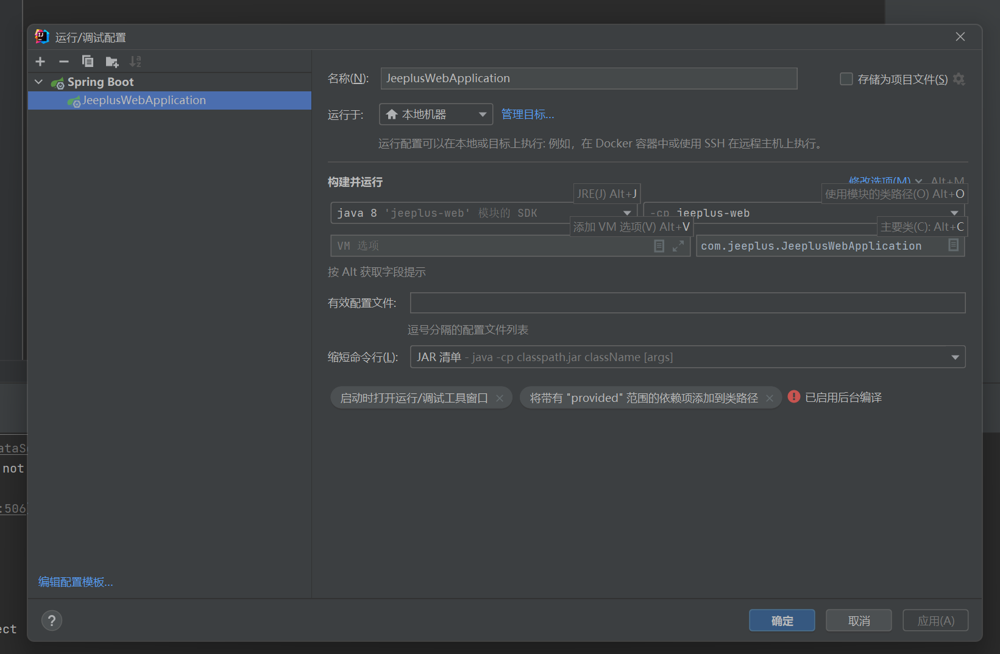

#### Idea 中出现：运行 Test 时出错。命令行过长。 通过 JAR 清单或通过[类路径](https://so.csdn.net/so/search?q=类路径&spm=1001.2101.3001.7020)文件缩短命令行，然后重新运行。

- 在项目.idea 目录下的workspace.xml增加如下配置

  ``` 
   <component name="PropertiesComponent">
      <property name="RunOnceActivity.OpenProjectViewOnStart" value="true" />
      <property name="RunOnceActivity.ShowReadmeOnStart" value="true" />
      <property name="settings.editor.selected.configurable" value="project.propCompiler" />
      <!--增加 -->
      <property name="dynamic.classpath" value="true" />
    </component>
  ```

- 设置运行选项

​      设置图片
